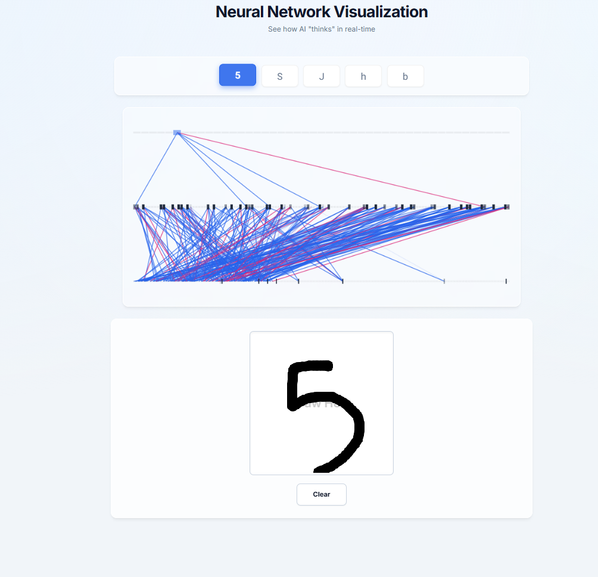
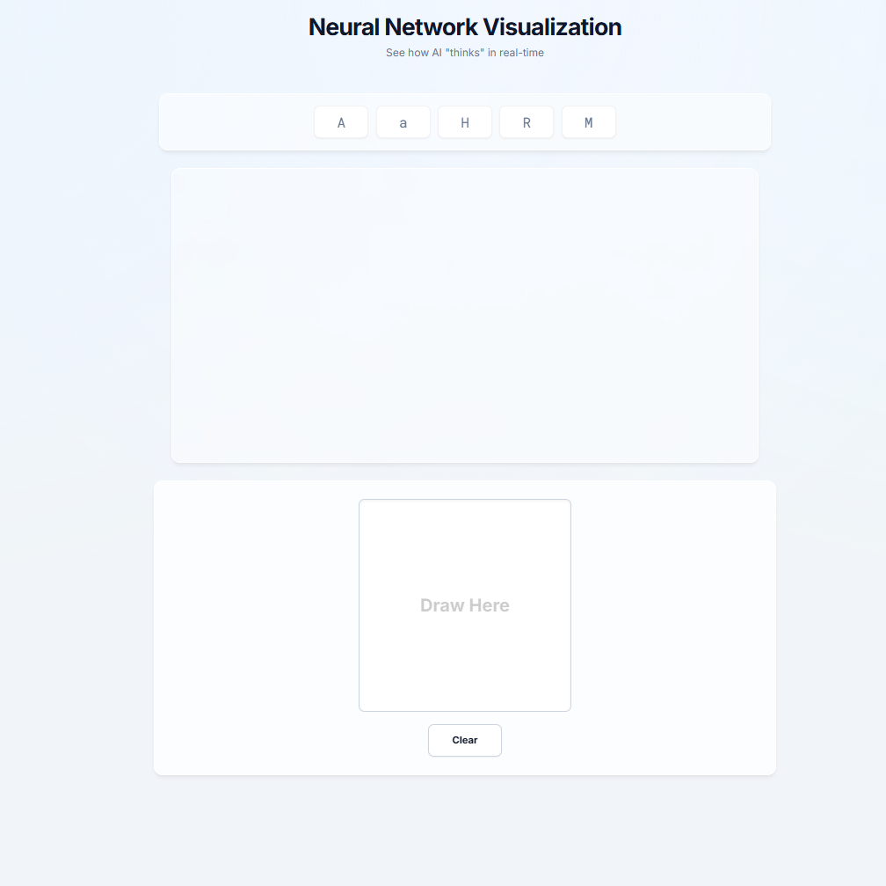
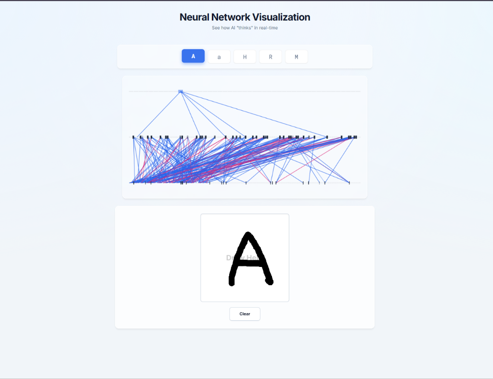

# Neural Network Visualization – Handwritten Recognition AI

A high-performance, interactive web application that visualizes how a Deep Convolutional Neural Network (CNN) sees and recognizes handwritten digits (0-9) and alphabets (A-Z). Designed with a premium "Lab Paper" aesthetic and biological neural visualization.

## 🚀 Features

-   **Deep Learning Brain**: Powered by a custom **CNN (Convolutional Neural Network)** trained on the EMNIST Balanced dataset (47 classes) to ~88% accuracy.
-   **Smart Vision** 👁️: Features **"Center of Mass"** preprocessing that automatically detecting, cropping, and centering your drawing—just like the way the AI was trained. This makes the app incredibly robust to messy or off-center inputs.
-   **Vertical Neural Stack**: A unique visualization that mimics biological signal flow (Input -> Hidden Layers -> Output) vertically up the screen.
-   **Dynamic Synapses**: Watch the network "think" in real-time. Connections light up in **Blue** (Excitatory) and **Magenta** (Inhibitory) as signals propagate.
-   **Universal Recognition**: Supports **Digits (0-9)**, **Uppercase (A-Z)**, and **Lowercase (a-z)** characters.
-   **Premium UI**: Clean, modern "Light Mode" interface with glassmorphism, smooth animations, and responsive design.

## 📂 Project Structure

```
nuralnetwork/
├── backend/                  # Python Flask Server & AI Logic
│   ├── app.py                # Main Application Server (API & Logic)
│   ├── train_model.py        # CNN Training Script (TensorFlow/Keras)
│   ├── emnist_model.h5       # The Trained AI Model File (~4MB)
│   ├── requirements.txt      # Python Dependencies
│   └── ...                   # Helper scripts (check_orientation.py, etc.)
│
├── frontend/                 # Web Interface
│   ├── index.html            # Main User Interface Structure
│   ├── styles.css            # Premium Styling (CSS Variables, Animations)
│   └── script.js             # Frontend Logic (Drawing, API, Visualization)
│
└── README.md                 # Project Documentation
```

## 🛠️ Tech Stack

-   **Frontend**: HTML5, CSS3 (Vertical Flexbox, Glassmorphism), JavaScript (Canvas API for drawing & visualization).
-   **Backend**: Python 3.x, Flask (Web Server), Flask-CORS.
-   **AI/ML**: TensorFlow/Keras (CNN Model), NumPy (Matrix Math), Pillow (Image Processing), Scikit-Learn (Data Loading).
-   **Dataset**: EMNIST (Extended MNIST) Balanced Split - 112,800 training samples.

## ⚡ How to Run

### Prerequisities
-   Python 3.8 or higher installed.

### 1. Setup Environment
Clone the repository and install the required dependencies:

```bash
pip install -r backend/requirements.txt
```

*(Dependencies: `tensorflow`, `flask`, `flask-cors`, `numpy`, `pillow`, `scikit-learn`, `pandas`)*

### 2. Train the Brain (Optional)
The project comes with a pre-trained model (`emnist_model.h5`), but if you want to retrain it yourself:

```bash
python backend/train_model.py
```
*This will download the EMNIST dataset, train the CNN for 15 epochs, and save the best model.*

### 3. Launch the App
Start the Flask backend server:

```bash
python backend/app.py
```

### 4. Open in Browser
Visit **`http://localhost:5000`** in your web browser.

## 🎮 How to Use

1.  **Draw** any character (0-9, A-Z) in the **"Draw Here"** box at the bottom.
2.  **Watch** the signals travel up through the neural layers in the center visualization.
3.  **See** the AI's prediction appear at the top.
4.  Use the **Clear** button to start over.

## 📸 Screenshots


*Clean, Vertical Interface*


*Real-time AI Recognition*


*Biological Neural Visualization*

## 🧠 Model Architecture

The AI uses a robust CNN architecture designed for spatial pattern recognition:

1.  **Input**: 28x28 Grayscale Image
2.  **Conv2D Block 1**: 32 Filters (3x3), ReLU, Batch Norm, MaxPool
3.  **Conv2D Block 2**: 64 Filters (3x3), ReLU, Batch Norm, MaxPool (Extracts complex features like loops and lines)
4.  **Dense Layer 1**: 256 Neurons (High-level reasoning)
5.  **Dense Layer 2**: 128 Neurons
6.  **Output**: 47 Neurons (Softmax probability distribution for each character)

*Built by [Meet Shingala]*
